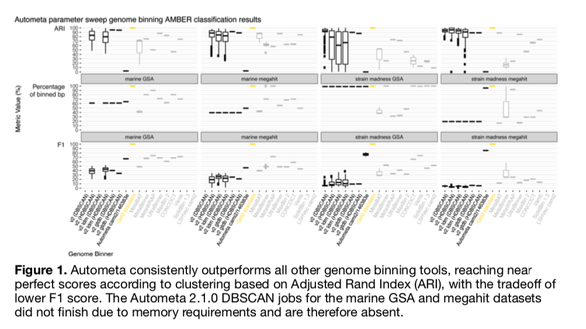
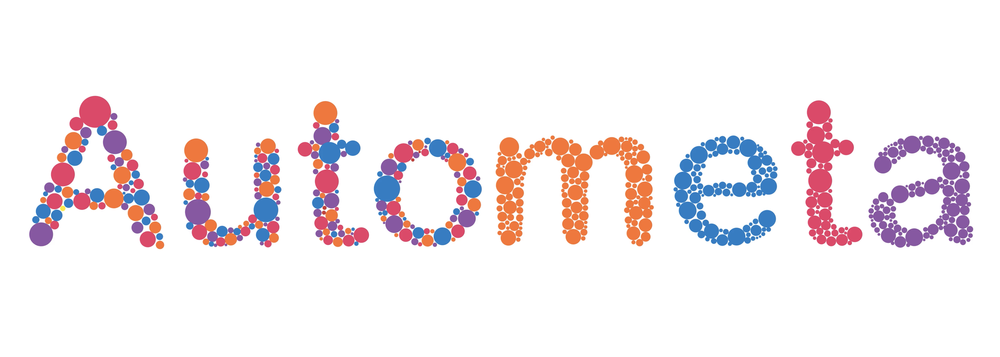

# **CAREER: Scalable binning algorithms for genome-resolved metagenomics**

Jason Kwan, Principal Investigator
University of Wisconsin-Madison

### **Major goals of the project**

The project aims to develop improved algorithms that are able to separate individual genomes from shotgun metagenomes, without the need for reference genomes, in a process called “binning”. The ultimate aim is to facilitate the study of the most complex microbiomes on Earth that have thousands of microbial species unknown to science, such as soil. We are also developing a discovery-based research course that will broaden undergraduate participation in big data analysis, bioinformatics and research. The project proposal had the following **specific aims**:
1. Develop algorithms to leverage taxonomy information and universally-conserved marker genes for binning both well- characterized and divergent species.
2. Develop pangenome-aware algorithms to leverage co-occurrence of the same species in multiple samples for binning.
3. Apply methods developed in Aims 1 and 2 to study the construction of diverse communities in soil.
4. Promote undergraduate engagement in STEM through a crowdsourced discovery-based research course.

### **Major Accomplishments and Significant Results** ###

- Manuscript for Autometa v2

    This manuscript is currently in a near-finished state with submission imminent. This paper includes a large scale parameter sweep evaluating Autometa against datasets used in the recent Critical Assessment of Metagenome Interpretation (CAMI) II challenge.  Additionally, new pipeline features include large data mode and integration with the Genome Taxonomy Database (GTDB).  Comparison with other binning tools allowed us to determine Autometa is capable of generating the most accurate (pure) bins as measured by Adjusted Rand Index (ARI). Autometa v2 is currently available for users.

    

- Manuscript for Automappa
  
    Manuscript describing Automappa, a newly developed graphical front-end for manually examining and refining Autometa binning results, is also in a near-finished state.

- Manuscript for Aim 3

    Manuscript describing new insights from the collaboration with Dr. Thea Whitman from a study following a planned prarie burn using matched burned and unburned plots to characterize soil metagenomes across time points. Since the last report, 24 additional metagenomes were sequenced and metagenome-assembled genomes (MAGS) were used to quantify the changes in microbial abundances across time points and between conditions.

- Aim 1.2 in progress

    A pipeline was created to expand the marker genes used in Autometa from a static 139 bacterial genes to incorporate taxon-specific marker sets used for bin validation and refinement in Autometa.  62,000 genomes from GTDB were used to generate sets of PFAM HMMs for each taxonomic node of Bacterial and Archael trees.  Currently, single-copy gene sets are being integrated into Autometa, but this will soon be expanded to multi-count genes sets.

- Redesign of metagenomics CURE

    Based on our experience with last year's course, we redesigned the curriculum to allow for more time for independent research.  We were able to utilize compute platforms such as Cyverse and KBase to prevent issues with installation and computational limits of students' computers.  Students were able to execute pre-built Jupyter notebooks that contained code examples and explanations to run metagenomics pipelines and generate figures.  Enrollment was low this year (5 students) due to its classification as a temporary "topics" class.  For next year this class has been approved to carry the Biological Sciences attribute and the Liberal Arts and Sciences credit, both of which allow this course to count towards students' degree programs which should lead to higher attendance.  We presented our CURE at the Tiny Earth Symposium and hope to release teaching materials for other instructores in the coming year.  
    
    Profile on our course: (<a href="https://pharmacy.wisc.edu/exploring-a-tiny-new-world/"> Link to Tiny Earth Genomics News Article </a>)

### **Software developed**

Autometa [Github repository](https://github.com/KwanLab/Autometa)

Autometa [Documenation](https://autometa.readthedocs.io/en/latest/)

    

Automappa [Github respository](https://github.com/WiscEvan/Automappa)

